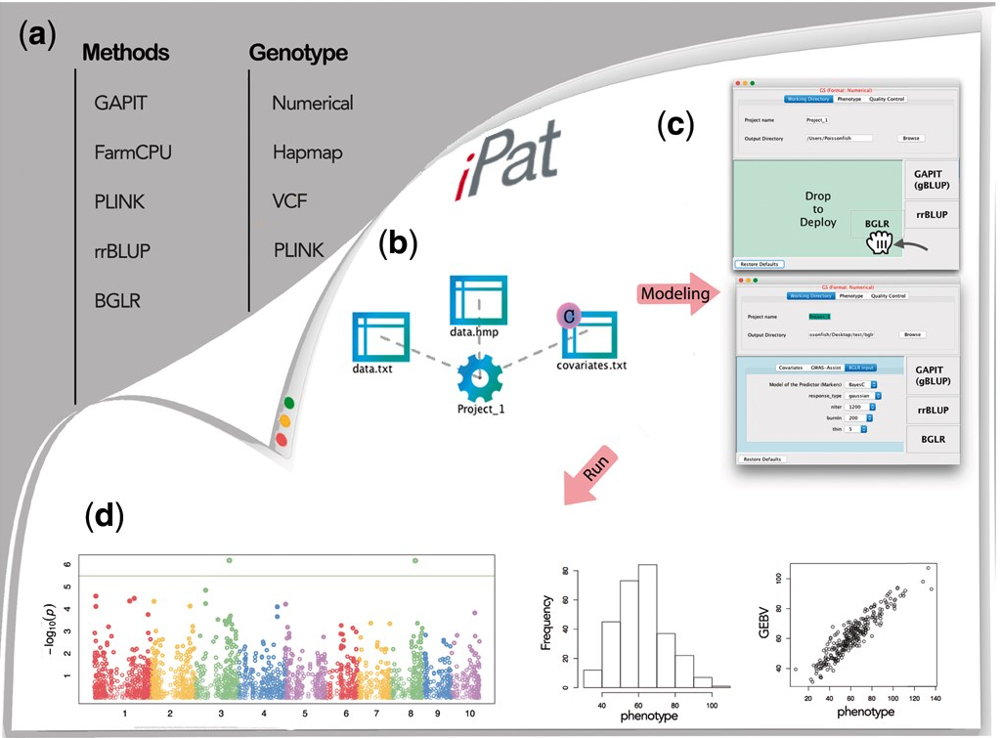
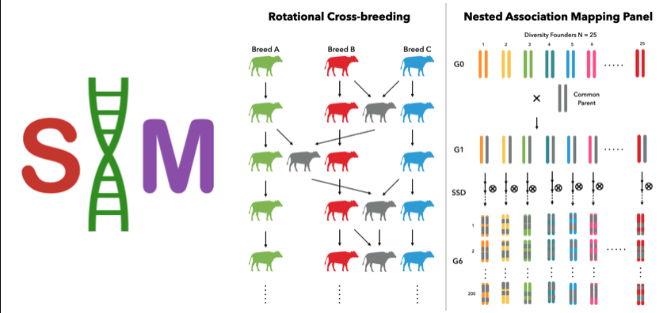
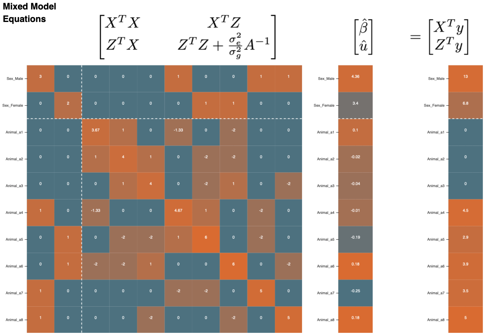

## **PUBLICATIONS** (10)

### **First/Co-First Author (5)**

1. **Chen, C.J.** and Zhang, Z. (2020) GRID: A Python Package for Field Plot Phenotyping Using Aerial Images. Remote Sensing, 12, 1697. &nbsp;&nbsp;
DOI
GitHub Repo.
Documentation

* 

















2. Liu, L., Zhou, J., **Chen, C.J.**, Zhang, J., Wen, W., Tian, J., Zhang, Z., and Gu, Y. (2020). GWAS-Based Identification of New Loci for Milk Yield, Fat, and Protein in Holstein Cattle. Animals 10, 2048.&nbsp;&nbsp;
DOI

3. Zhou, J., Liu, L., **Chen, C.J.**, Zhang, M., Lu, X., Zhang, Z., Huang, X., and Shi, Y. (2019). Genome-wide association study of milk and reproductive traits in dual-purpose Xinjiang Brown cattle. BMC Genomics 20, 827.&nbsp;&nbsp;
DOI

* 





4. **Chen C.J.**, Zhang, Z. (2018) GWAS and GS are as easy as clicking and dragging with iPat.
Proceedings of the World Congress on Genetics Applied to Livestock Production, Auckland, New Zealand.&nbsp;&nbsp;
PDF

5. **Chen C.J.**, Zhang, Z. (2018) iPat: intelligent prediction and association tool for genomic research. Bioinformatics, 34, 1925-1927.&nbsp;&nbsp;
DOI
GitHub Repo.
Documentation

* 








### **Co-Author (1)**
6.  Tang, Z., Parajuli, A., **Chen, C.J.**, Hu, Y., Revolinski, S., Medina, C.A., Lin, S., Zhang, Z., and Yu, L.X. (2021). Validation of UAV-based alfalfa biomass predictability using photogrammetry with fully automatic plot segmentation. Scientific Reports 11, 3336.
DOI

### **Under Publication (4)**

7.   **Chen, C.J.**, Morota, G., and Cheng, H. (2021). Livestock Tracking with Unsupervised Approach.
* 





8. **Chen, C.J.**, Garrick, D., Fernando, R., Karaman, E., and Cheng, H. (2021). XSim Version 2: Simulation of Modern Breeding Programs.
GitHub Repo.
Documentation

* 





9. **Chen, C.J.** and Cheng, H. (2021). LMMonBoard: An Interactive Dashboard for Visualizing Mixed Models in Quantitative Genetics.
GitHub Repo.
Web-App

* 











10.  **Chen, C.J.**, Rutkoski, J., Schnable, J., Murray, S., Wang, L., Jin, X., Stich, B., Crossa, J., Hayes, B, and Zhang, Z. (2021). Harnessing Agronomics Through Genomics and Phenomics in Plant Breeding: A Review.
Pre-Print
