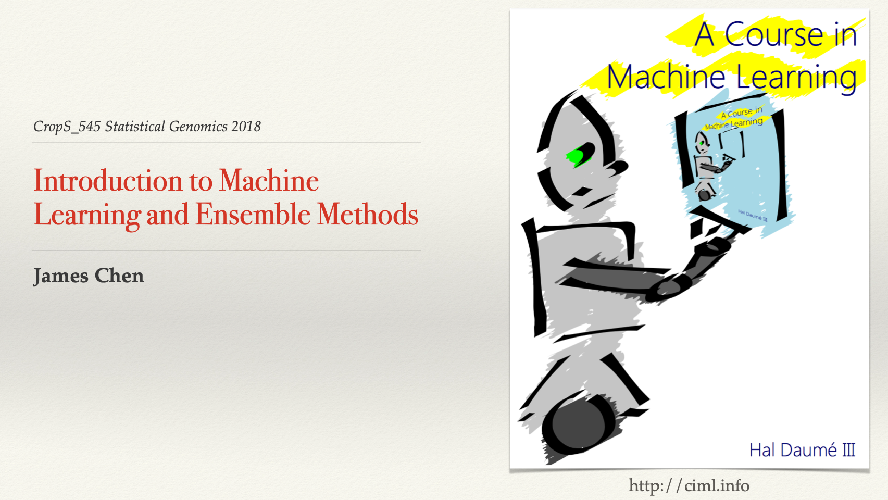
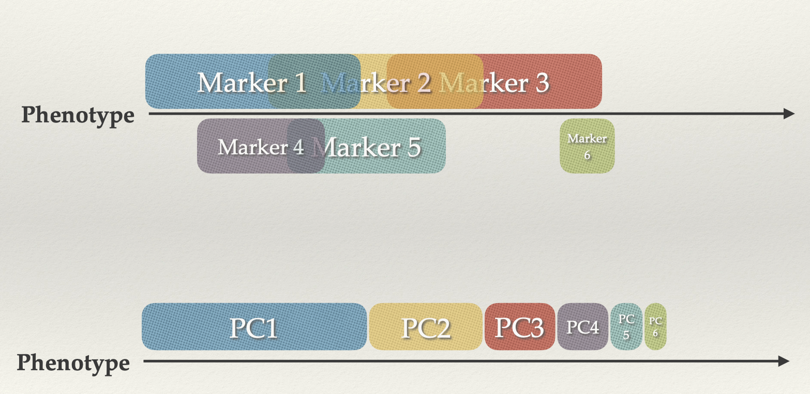

## **TEACHING**

### **Undergrad Intern Training**
* 06/2021 - Present &nbsp;&nbsp;&nbsp;&nbsp;&nbsp; Animal Science, University of California Davis

  * A Guideline for Diagnosing Association Mapping Population

### **Guest Lectures**
* 05/2018 &nbsp;&nbsp;&nbsp;&nbsp;&nbsp; CropS 545: Statistical Genomics at Washington State University&nbsp;&nbsp;&nbsp;&nbsp;&nbsp;Slides

  * Introduction to Machine Learning and Ensemble Methods



<--->



* 02/2017 &nbsp;&nbsp;&nbsp;&nbsp;&nbsp; CropS 545: Statistical Genomics at Washington State University &nbsp;&nbsp;&nbsp;&nbsp;Slides

  * Principal Component Analysis



<--->



### **Teaching Assistant**
* Spring 2017&nbsp;&nbsp;&nbsp;&nbsp;
CropS 545: Statistical Genomics at Washington State University&nbsp;&nbsp;&nbsp;&nbsp;
Website